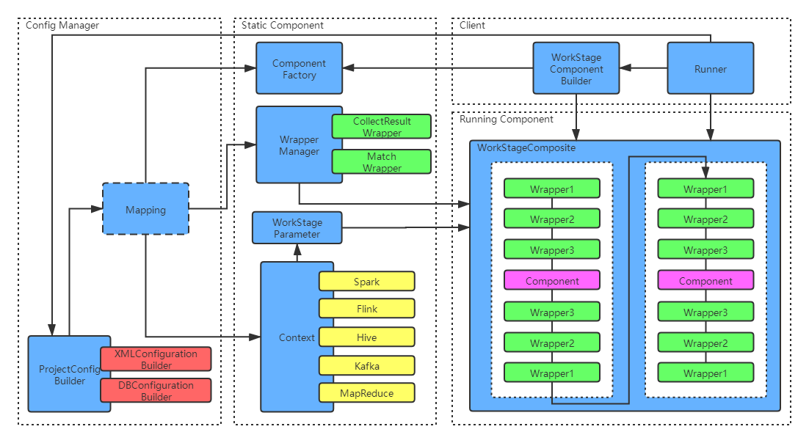

# magnet

快速搭建流式处理应用！简单实用的分布式大数据处理框架。

### 软件架构

项目目前由core、xmlbuilder、spark1和client四个模块组成，core模块封装了各个部分的抽象组件；xmlbuilder模块是以xml解析为执行配置来源的读取模块；spark1模块为大数据引擎模块；client模块是客户端调用模块。项目可以扩展执行配置的解析方式和大数据处理引擎，良好的接口可以兼容任何大数据引擎。架构图中蓝色部分为框架的核心模块，非蓝色部分均为可扩展模块。你可以扩展配置文件的格式，可以是json配置、db配置或自定义格式；你也可以扩展大数据处理引擎，Flink、Hive、Kafka或MapReduce；你也可以扩展各种标签组件；你还可以扩展每个标签组件的包装wrapper，用于处理每个标签组件的前置和后置操作。